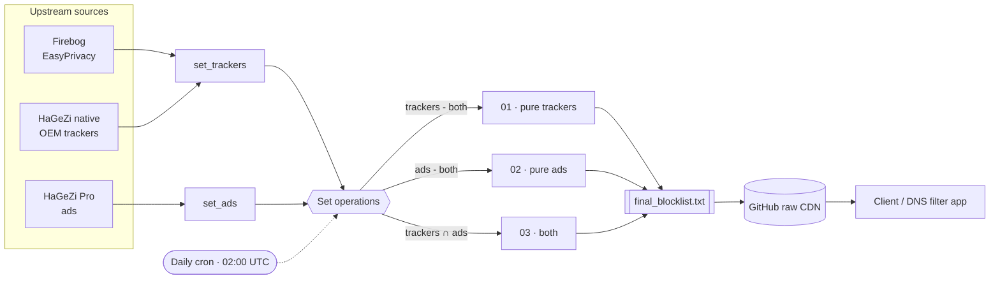

<div align="center">

# Elide Threat Intelligence

### Serverless, self-updating DNS blocklist engine

A zero-infrastructure pipeline that fuses multiple upstream tracker and ad blocklists into a single, category-tagged ruleset — rebuilt every day by GitHub Actions and served straight from GitHub's raw CDN.

[](https://github.com/supreme-selva/Elide-threat-intelligence/actions/workflows/update.yml)
[](LICENSE)


[](https://github.com/supreme-selva/Elide-threat-intelligence/commits/main)

</div>

---

## Overview

**Elide Threat Intelligence** downloads several curated DNS blocklists, classifies every domain by set membership (tracker-only, ad-only, or both), and publishes one merged, sorted, category-prefixed file — `final_blocklist.txt`. A scheduled GitHub Actions workflow rebuilds it daily and commits the result back to the repository, so downstream clients (such as an Android DNS filter) always fetch the freshest ruleset over GitHub's raw CDN.

No servers. No databases. No dependencies beyond the Python standard library.

## Table of contents

- [Highlights](#highlights)
- [Architecture](#architecture)
- [Classification logic](#classification-logic)
- [Output format](#output-format)
- [Consuming the ruleset](#consuming-the-ruleset)
- [Local development](#local-development)
- [Automation](#automation)
- [Project structure](#project-structure)
- [Data source & attribution](#data-source--attribution)
- [Contributing](#contributing)
- [Security](#security)
- [License](#license)

## Highlights

- **Serverless by design** — the entire pipeline is a single scheduled GitHub Actions workflow. There is nothing to host or pay for.
- **Deterministic set logic** — domains are bucketed by exact set membership, so every domain appears exactly once with a stable category tag.
- **Zero dependencies** — pure Python standard library (`urllib`), so it runs anywhere Python 3.10+ is available.
- **CDN-native distribution** — the output is a plain text file delivered by GitHub's raw CDN; clients need only an HTTP GET.
- **Transparent & reproducible** — every rebuild is a commit you can inspect, diff, and roll back.
- **Fail-safe builds** — a failed source download aborts the run with a non-zero exit code, so a partial or truncated list is never published.

## Architecture



## Classification logic

Sources are grouped into two sets, and each domain is assigned to exactly one category based on where it appears:

```
set_trackers  = union of all tracker lists      (EasyPrivacy + HaGeZi native OEM)
set_ads       = union of all ad lists           (HaGeZi Pro)

set_both      = set_trackers ∩ set_ads          ->  03   (present in both)
pure_trackers = set_trackers − set_both         ->  01   (tracker only)
pure_ads      = set_ads − set_both              ->  02   (ad only)
```

Because the three buckets are disjoint, no domain is ever emitted twice.

## Output format

`final_blocklist.txt` is UTF-8, LF-terminated, sorted, one entry per line. Each line is a two-digit category tag, a single space, then the domain:

```
01 tracker.example.com
02 ads.example.net
03 tracker-and-ad.example.org
```

| Tag  | Category      | Meaning                                                    |
| ---- | ------------- | ---------------------------------------------------------- |
| `01` | Pure trackers | Present only in the tracker sources                        |
| `02` | Pure ads      | Present only in the ad sources                             |
| `03` | Both          | Present in a tracker source **and** an ad source           |

## Consuming the ruleset

Fetch the latest ruleset directly from the raw CDN:

```
https://raw.githubusercontent.com/supreme-selva/Elide-threat-intelligence/main/final_blocklist.txt
```

Example — count entries per category:

```bash
curl -s https://raw.githubusercontent.com/supreme-selva/Elide-threat-intelligence/main/final_blocklist.txt \
  | cut -d' ' -f1 | sort | uniq -c
```

## Local development

Requires **Python 3.10+**. There are no third-party dependencies to install.

```bash
python process_lists.py
```

This regenerates `final_blocklist.txt` in the repository root and prints per-category counts (`01`, `02`, `03`) and a total.

## Automation

The [`Update Blocklist`](.github/workflows/update.yml) workflow runs:

- **On a schedule** — daily at `02:00 UTC`.
- **On demand** — via the Actions tab (`workflow_dispatch`).
- **On push to `main`** — when `process_lists.py` or the workflow itself changes.

Each run checks out the repo, sets up Python 3.10, rebuilds the list, writes a summary of the category counts to the run's job summary, and commits `final_blocklist.txt` back with [`git-auto-commit-action`](https://github.com/stefanzweifel/git-auto-commit-action) only when the content actually changes.

## Project structure

```text
.
├── .github/
│   ├── ISSUE_TEMPLATE/
│   │   ├── bug_report.md
│   │   ├── feature_request.md
│   │   └── config.yml
│   ├── PULL_REQUEST_TEMPLATE.md
│   └── workflows/
│       └── update.yml          # Daily build + auto-commit workflow
├── process_lists.py            # The build engine (stdlib only)
├── final_blocklist.txt         # Generated, category-tagged ruleset (CDN artifact)
├── CHANGELOG.md
├── CODE_OF_CONDUCT.md
├── CONTRIBUTING.md
├── SECURITY.md
├── LICENSE                     # GNU GPL-3.0
├── .editorconfig
└── .gitignore
```

## Data source & attribution

The blocklists generated in this repository are modified derivatives of the [HaGeZi DNS Blocklists](https://github.com/hagezi/dns-blocklists) and the [EasyPrivacy](https://easylist.to/) list (mirrored and parsed by [Firebog](https://firebog.net/)), both licensed under the GPL-3.0 License. This repository and its outputs are distributed under the same GPL-3.0 License.

Please support the upstream maintainers:

- **HaGeZi's DNS Blocklists** — https://github.com/hagezi/dns-blocklists
- **EasyList / EasyPrivacy** — https://easylist.to/
- **Firebog** — https://firebog.net/

## Contributing

Contributions are welcome. Please read [`CONTRIBUTING.md`](CONTRIBUTING.md) and the [`CODE_OF_CONDUCT.md`](CODE_OF_CONDUCT.md) before opening an issue or pull request.

## Security

Found a problem or a source that should be added or removed? See [`SECURITY.md`](SECURITY.md) for how to report it responsibly.

## License

Distributed under the **GNU General Public License v3.0**. See [`LICENSE`](LICENSE) for the full text.
